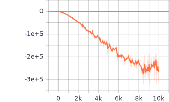
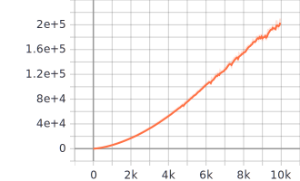
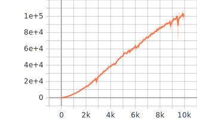
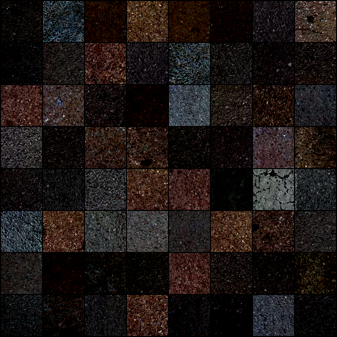
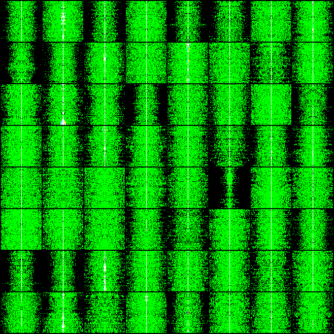
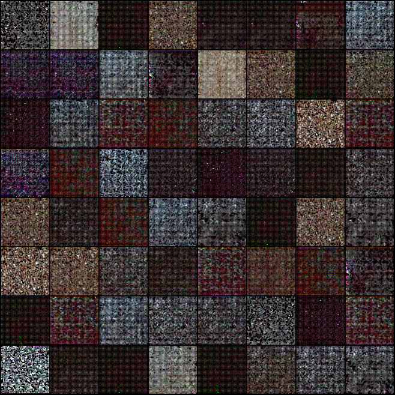
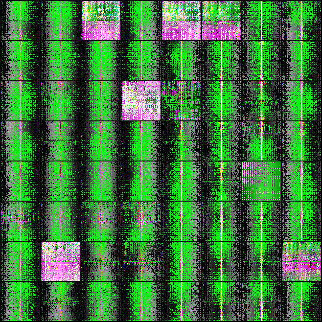

# Adversarial Image-to-Frequency Transform Network
Toy example for 'Adversarially Learnt Image to Frequency Transform Network (AIFT)' on the paper (
Unsupervised Pixel-level Road Defect Detection via Adversarial Image-to-Frequency Transform) (Implemented with Py36 and Pytorch)

* The paper is submitted to IV2020, and it is under the review.
* This source code is a toy example for AITF, and it does not include the evaluation code for the experiments on the paper.
Contact: [jm.andrew.yu@gmail.com] Any questions or discussions are welcomed! 

## Abstract.
In the past few years, the performance of road defect detection has been remarkably improved thanks to advancements on various studies on computer vision and deep learning. Although a large-scale and well-annotated datasets enhance the performance of detecting road pavement defects to some extent, it is still challengeable to derive a model which can perform reliably for various road conditions in practice, because it is intractable to construct a dataset considering diverse road conditions and defect patterns. To end this, we propose an unsupervised approach to detecting road defects, using Adversarial Image-to-Frequency Transform (AIFT). AIFT adopts the unsupervised manner and adversarial learning in deriving the defect detection model, so AIFT does not need annotations for road pavement defects. We evaluate the efficiency of AIFT using GAPs384 dataset, Cracktree200 dataset, CRACK500 dataset, and CFD dataset. The experimental results demonstrate that the proposed approach detects various road detects, and it outperforms existing state-of-the-art approaches.

## File configuration
. 
├── frequency_discriminator.pkl 
├── image_discriminator.pkl 
├── inception_score_graph.txt 
├── logs 
│   └── events.out.tfevents.1578130324.neumann-System-Product-Name 
├── main.py 
├── model 
│   ├── aiftn.py 
│   └── __pycache__ 
│       └── aiftn.cpython-36.pyc 
├── negative_generator.pkl 
├── positive_generator.pkl 
├── README.md 
├── src 
│   ├── config.py 
│   ├── dataset.py 
│   ├── __init__.py 
│   ├── __pycache__ 
│   │   ├── config.cpython-36.pyc 
│   │   ├── dataset.cpython-36.pyc 
│   │   ├── __init__.cpython-36.pyc 
│   │   ├── tensorboard_logger.cpython-36.pyc 
│   │   └── utils.cpython-36.pyc 
│   ├── tensorboard_logger.py 
│   └── utils.py 
├── tb_log.txt 
├── test.png 
├── _t_main.py 
└── training_result_vis 

## How to train
~~~
python main.py
~~~

## Curves of the cost functions on AITF. 
(Loss for Discriminator, generator for positive phase, generator for negative phase)

      

## Given and transformed samples (40000 Iterations)
Given image and frequency samples.

     

Transformed image and frequency samples.

     

bibtex as follows:

